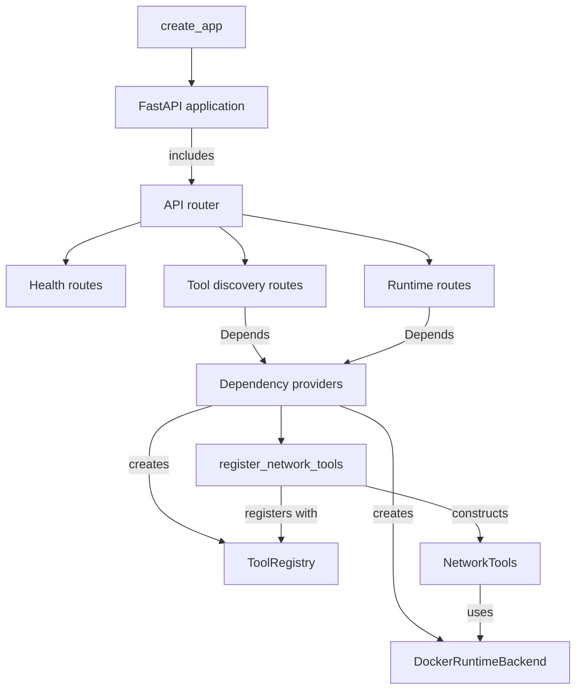
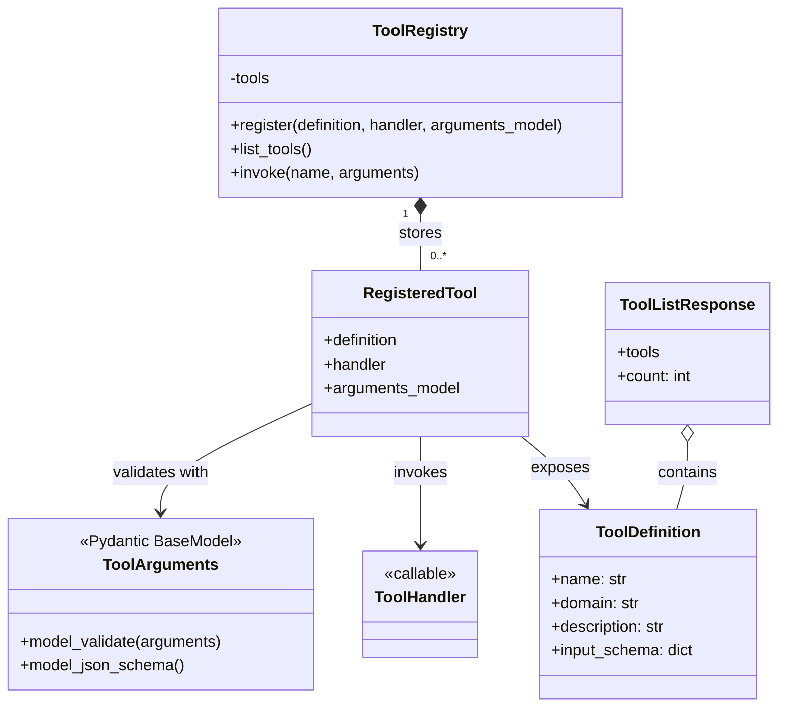
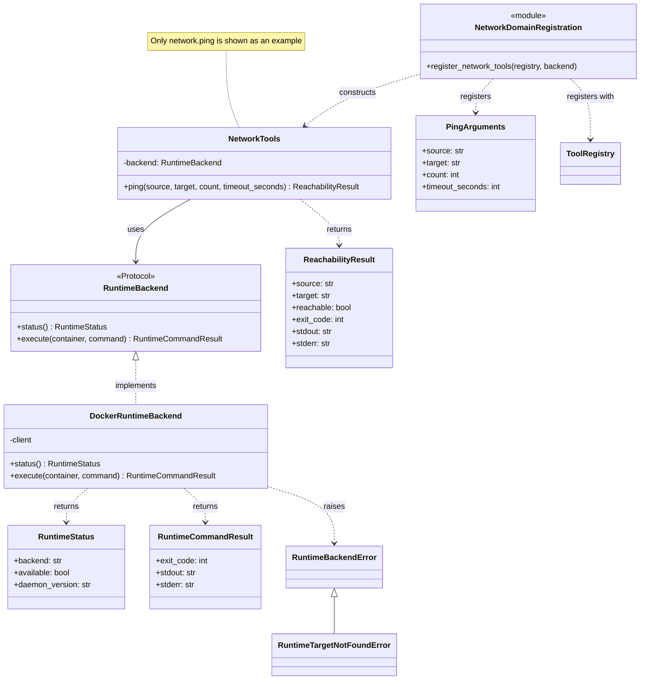
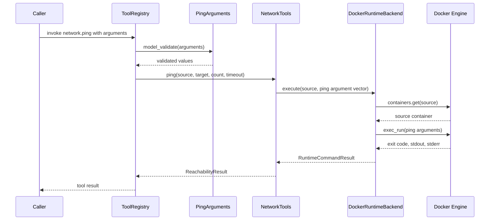

# Tool Service Class Structure

## Application Composition

This diagram shows how the FastAPI application, route modules, dependency providers, registry,
tool domains, and runtime backend are assembled.

The dependency-provider module is the composition root. It creates the runtime backend, builds the
registry, and asks each domain to register its tools.

## Registry Classes

The registry keeps agent-visible metadata separate from executable Python callables. Registration
associates each handler with an explicit Pydantic argument model, from which the registry generates
the input JSON Schema.

`ToolDefinition` is returned by tool discovery. `ToolHandler` and the explicit argument-model class
remain internal to the service and are used when `ToolRegistry.invoke()` executes a tool.

## Network Domain and Runtime Backend

The network domain owns its argument and result models. `NetworkTools` depends only on the
`RuntimeBackend` protocol, so another backend can replace Docker without changing the tools. To
keep the diagram readable, only `network.ping` is shown as a representative tool; other network
tools follow the same structure.

## Ping Invocation Sequence

The following sequence shows how the registered `PingArguments` model is used during an invocation
of `network.ping`.

The ping command is passed as an argument vector rather than a shell command. An exit code of zero
is mapped to `reachable = true`; other ping exit codes are mapped to `reachable = false`.
