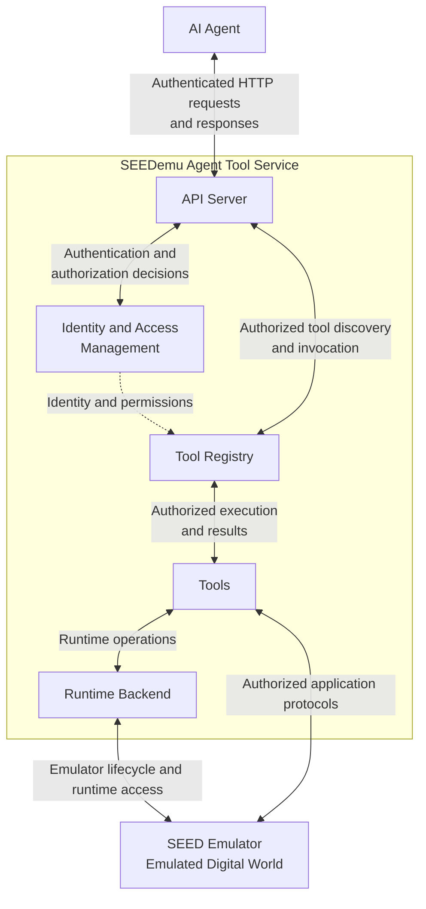

# SEED Emulator Tool Service Design

## Overview

The SEED Emulator Tool Service is the agent-facing action and observation layer for a SEED-Emulator environment. It gives agents a structured interface for discovering and invoking tools without requiring them to understand how the emulator is deployed or how each operation is implemented.

This document describes the high-level architecture. Internal tool categories, individual tool implementations, and runtime-backend variants are intentionally outside its scope.

## Architecture

The tool service and SEED Emulator run on the same host. This keeps runtime control and direct access to emulated services local while allowing agents to interact with the system through a single HTTP-facing boundary.

## Component Responsibilities

### Agent

The agent selects tools and uses their results to plan subsequent actions. Agent implementations are clients of the tool service and are not part of the service itself.

### API Server

The API server is the external boundary of the tool service. It accepts agent requests, coordinates authentication and authorization, forwards authorized tool operations, and returns structured responses.

### Identity and Access Management

Identity and access management authenticates agents and other service identities, evaluates authorization policies, and supplies the identity and permission context used during tool discovery and invocation.

### Tool Registry

The tool registry maintains the tools available to agents and their descriptions. It supports tool discovery and dispatches validated invocations to the selected tool.

### Tools

Tools implement the actions and observations available to agents. A tool may use the runtime backend to interact with the deployed environment or communicate directly with a service inside the emulated digital world using an application protocol.

### Runtime Backend

The runtime backend hides deployment-specific details from tools. It provides a consistent interface for emulator lifecycle management and runtime access, regardless of the underlying deployment technology.

### SEED Emulator

The SEED Emulator hosts the emulated digital world, including its networks, nodes, routers, and application services. It remains an independently engineered system consumed by the tool service.

## Interaction Paths

There are two primary paths from an agent to the emulated environment:

1. **Backend-mediated operations:** the agent invokes a tool, and the tool uses the runtime backend for deployment-aware control or inspection of the emulator.
2. **Direct service operations:** the agent invokes a tool that communicates directly with an emulated service through an application protocol such as HTTP, SMTP/IMAP, DNS, or a blockchain RPC interface.

Before either path is used, the API server authenticates the agent and obtains an authorization decision. The resulting identity and permission context limits which tools the agent can discover and invoke. Both paths return results through the tool registry and API server, giving the agent a consistent interface independent of the underlying operation.

## Design Boundaries

- The tool service owns the agent-facing API, identity and access management, tool discovery, invocation, and result handling.
- Tools own domain-specific actions and observations, but their internal design is not defined here.
- The runtime backend owns deployment-specific integration with the running emulator.
- SEED-Emulator owns the construction and behavior of the emulated digital world.
- Agent implementation and orchestration are outside the scope of the tool service.
