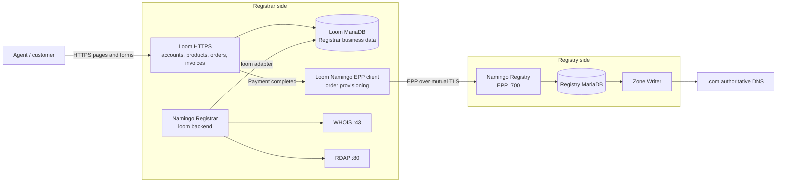
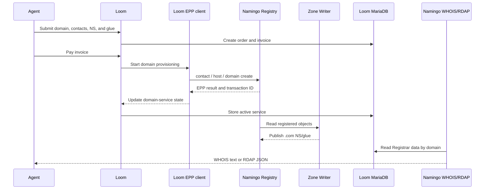

# Namingo Registrar and Loom architecture

## Overall structure

In B02a, Loom and Namingo Registrar form the Registrar side while serving different roles. Loom is the customer and order system; Namingo Registrar supplies registration-data lookup services. Both use the Registrar business data stored in Loom MariaDB.



The important relationships are:

- Loom stores customers, orders, invoices, and domain-service state and performs EPP provisioning after payment.
- Namingo Registrar reads Loom data through its upstream `loom` backend and exposes WHOIS/RDAP for the same domains.
- Namingo Registry stores the final domain, contact, and host objects and drives `.com` zone publication.

## Data flow



The Registry and Loom store different views of the registration. The Registry is the final TLD ledger, while Loom stores the Registrar's customer and order view. WHOIS/RDAP uses the Loom view; Registry Zone Writer publishes the DNS delegation.

## SeedEmu deployment

```text
10.150.0.74  Loom HTTPS frontend + Loom MariaDB + order EPP client
10.150.0.73  Namingo Registrar WHOIS/RDAP
10.154.0.73  Namingo Registry EPP + Registry MariaDB + Zone Writer
```

B02a configures `NamingoRegistrarService` with the upstream `loom` backend and an external database connection to Loom MariaDB. A dedicated read-only account lets WHOIS/RDAP query Loom provider, service, contact, and nameserver data. Namingo automation is disabled because Loom owns the order-driven lifecycle.

The pinned Namingo Registrar adapter and Loom schema use different names for the service-type field. The image build verifies the expected upstream code and applies the compatibility adjustment needed to query Loom's current `services.type` field.

## Relationship to Agent tools

The Agent purchases through Loom rather than Namingo Registrar:

1. `domain.registrar_find` discovers the Loom HTTPS origin.
2. `domain.registrar_request` accesses Loom from the selected source, maintains the session, and submits registration and payment forms.
3. Loom performs order handling and EPP provisioning internally.
4. Namingo WHOIS/RDAP exposes the resulting Registrar data.
5. `dns.check_delegation` and `dns.lookup` verify delegation and final resolution.

`domain.registrar_request` works with the normal HTML/HTTP frontend instead of defining a private Loom purchase API. Its source-local session supports page discovery, CSRF fields, redirects, and multi-step forms.

## Relationship to DNS

After successful registration, Registry Zone Writer adds the `example.com` NS and glue to the `.com` zone. The hidden Primary loads the zone and synchronizes public Secondaries. Resolvers can then follow the delegation to the source-owned `example.com` authorities.

Ordinary records such as `www.example.com` are updated with `dns.configure` after purchase. Changes to delegated nameservers or glue return to the Registrar/Registry lifecycle.

## Related implementation

- `seed-emulator/seedemu/services/LoomRegistrarService.py`
- `seed-emulator/seedemu/services/NamingoRegistrarService.py`
- `seed-emulator/seedemu/services/NamingoRegistryService.py`
- `seed-emulator/examples/internet/B02a_domain_registration/domain_registration.py`
- `seedemu-agent-tools/tool-service/seedemu_tool_service/tools/dns/`

See `domain_register_design.md` for the complete Agent, Registrar, Registry, and DNS architecture.

## Upstream projects

- [Loom](https://github.com/getnamingo/loom)
- [Namingo Registrar](https://github.com/getnamingo/registrar)
- [Namingo Registrar Loom integration](https://github.com/getnamingo/registrar/blob/main/docs/install-loom.md)
- [Namingo Registry](https://github.com/getnamingo/registry)
- [Namingo EPP Client](https://github.com/getnamingo/epp-client)
