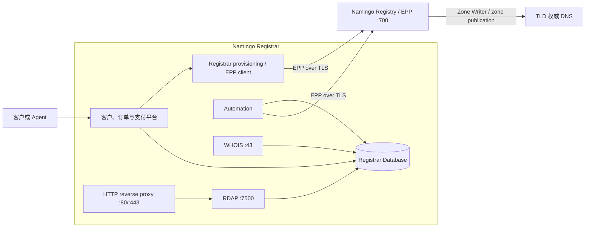
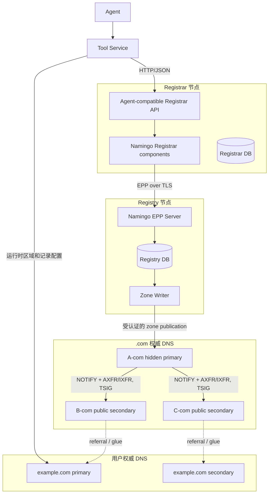

# Namingo Registrar 框架与 SeedEmu 本地化移植说明

## 1. 文档目标

本文介绍 Namingo Registrar 的组件框架、数据与协议边界，并说明将其本地化移植到
SeedEmu 仿真器时可能需要的改动。

这里的“Registrar”指面向客户或 Agent 的注册商业务系统；它不是顶级域注册局
（Registry），也不是 `.com` 权威 DNS。一次完整注册至少涉及四个相互独立的角色：

1. **Registrar**：接收客户或 Agent 的查询、购买和域名管理请求；
2. **Registry**：通过 EPP 接受已授权 Registrar 的注册命令，维护 TLD 的唯一登记数据；
3. **TLD 权威 DNS**：发布 Registry 批准的父区 NS 和 glue；
4. **用户权威 DNS**：托管 `example.com` 内部的 `www`、MX、TXT 等记录。

因此，移植 Namingo Registrar 不能单独解决 Registry 和 TLD DNS 发布问题，也不应让
Registrar 直接修改 `.com` zone。

## 专业术语速查

下面的解释以本文的 Namingo/SeedEmu 场景为准，重点说明每个术语在域名注册链路中承担的
角色。

### 域名注册参与方

| 术语                 | 中文及含义                                                                        | 在本文中的位置                                                  |
| -------------------- | --------------------------------------------------------------------------------- | --------------------------------------------------------------- |
| **Registrant** | 域名注册人，即申请并使用域名的个人或组织                                          | 通过 Registrar 提交联系人、域名和 nameserver 信息               |
| **Registrar**  | 域名注册商，面向 Registrant 提供查询、购买、续费和域名管理服务                    | Namingo Registrar 所在一侧；通过 EPP 向 Registry 申请注册       |
| **Registry**   | 域名注册局，维护某个 TLD 下最终且唯一的注册数据                                   | Namingo Registry 所在一侧；决定域名能否注册并触发 TLD zone 发布 |
| **TLD**        | Top-Level Domain，顶级域，例如`.com`、`.net`                                  | Registry 管理的名字空间，也是父区权威 DNS 发布的 zone           |
| **ICANN**      | Internet Corporation for Assigned Names and Numbers，互联网名称与数字地址分配机构 | 制定和协调通用顶级域注册体系中的许多政策与合规要求              |

Registrar 和 Registry 经常被混淆。可以把它们简单理解为：Registrar 接受用户订单，
Registry 维护 TLD 的最终登记簿。Registrar 本地显示“可购买”不能替代 Registry 的最终
唯一性检查。

### 客户与计费平台

| 术语                              | 解释                                                                                         | 与 Namingo 的关系                                                                                           |
| --------------------------------- | -------------------------------------------------------------------------------------------- | ----------------------------------------------------------------------------------------------------------- |
| **FOSSBilling**             | 面向主机及数字服务商的自由开源客户和计费平台，提供客户账户、产品、订单、账单、支付和扩展模块 | Namingo 可以通过 FOSSBilling Registrar/EPP 模块承载客户购买和域名订单；它不是 Registry，也不是权威 DNS      |
| **WHMCS**                   | 商业化主机业务自动化平台，提供客户、订单、账单、工单和域名模块                               | Namingo 提供相应集成，但 WHMCS 本身不是开源软件；使用它会引入授权和更完整的业务系统开销                     |
| **Loom**                    | Namingo 支持的一种客户、计费及 Registrar 业务平台选择                                        | 可为 Namingo 提供前端、账户、订单及数据库 Schema；相关集成仍需按上游版本验证                                |
| **Custom billing platform** | 用户自行实现的客户、订单、支付或后台平台                                                     | 必须自行适配 Namingo 的数据库、EPP provisioning、WHOIS/RDAP 查询模型和业务状态                              |
| **Backend adapter**         | 将统一的 WHOIS/RDAP 查询接口转换为特定平台数据库查询的适配层                                 | Namingo 提供`foss`、`whmcs`、`loom` 和 `custom` 选择；`custom` 默认只是模板，并非自动适配 SeedEmu |
| **Schema**                  | 数据库表、字段、索引和约束的结构定义                                                         | 不同计费平台的 Schema 不同，Namingo RDDS adapter 必须与实际 Schema 匹配                                     |

FOSSBilling 在本文中不是 Namingo 的“依赖包”，而是一种可选的完整业务前端。如果实验只
需要 Agent 发起注册、Registrar 通过 EPP 访问 Registry，则可以不安装 FOSSBilling，改用
轻量 compatibility API 和自定义数据模型。

### 协议与查询服务

| 术语                     | 全称与作用                                                                                                                  | 典型边界                                                             |
| ------------------------ | --------------------------------------------------------------------------------------------------------------------------- | -------------------------------------------------------------------- |
| **EPP**            | Extensible Provisioning Protocol，可扩展供应协议；Registrar 与 Registry 之间管理 domain、contact、host 等注册对象的标准协议 | Registrar → Registry，通常使用 TCP/TLS 和客户端证书                 |
| **RDDS**           | Registration Data Directory Services，注册数据目录服务的统称                                                                | 本文主要包括 WHOIS 和 RDAP，是查询面，不负责购买域名                 |
| **WHOIS**          | 传统的文本式注册数据查询协议，通常使用 TCP 43 端口                                                                          | 查询 Registrar 数据库并返回文本结果                                  |
| **RDAP**           | Registration Data Access Protocol，基于 HTTP 和 JSON 的现代注册数据查询协议                                                 | Namingo RDAP 内部监听`127.0.0.1:7500`，再由反向代理暴露            |
| **TLS**            | Transport Layer Security，为网络连接提供加密、服务端认证及可选的客户端认证                                                  | 用于 EPP over TLS；其证书和密钥不同于 DNS 区域传送的 TSIG            |
| **CA**             | Certificate Authority，证书颁发机构                                                                                         | 在仿真中可由实验专用 CA 签发 Registry 服务端和 Registrar 客户端证书  |
| **Result code**    | EPP 响应中的标准结果码                                                                                                      | Registrar 应根据结果码区分成功、已存在、参数错误、认证失败和临时故障 |
| **Transaction ID** | 一次 EPP 事务的客户端/服务端标识                                                                                            | 应与 Registrar order ID 关联，用于审计、重试判断和问题追踪           |

常见的 EPP 对象和命令包括：

- `domain:check`：查询 Registry 中域名是否可注册；
- `contact:create`：创建注册人或其他联系人对象；
- `host:create`：创建 nameserver host，必要时携带 glue 地址；
- `domain:create`：创建域名注册对象；
- `domain:update`：修改 nameserver、状态或关联信息；
- `domain:info`：读取 Registry 中的域名登记状态。

### DNS 发布术语

| 术语                              | 解释                                                                    | 在 Namingo/SeedEmu 中的用途                                                              |
| --------------------------------- | ----------------------------------------------------------------------- | ---------------------------------------------------------------------------------------- |
| **Zone**                    | DNS 区域及其权威记录集合，例如`.com` zone 或 `example.com` zone     | `.com` zone 保存子域委派；`example.com` zone 保存 `www`、MX、TXT 等内部记录        |
| **Zone Writer**             | 把 Registry 数据库中的有效注册、NS 和 glue 转换为 TLD zone 内容的组件   | 位于 Registry 控制面，输出交给 A-com hidden primary，而不是直接回答公共 DNS 查询         |
| **Hidden primary**          | 隐藏主权威服务器，保存和装载主 zone，但通常不对普通互联网客户端提供查询 | 文中的 A-com；接收 Registry 发布，并向公共 secondary 发送 NOTIFY                         |
| **Authoritative secondary** | 从 primary 传送 zone 并对外提供权威解析的服务器                         | 文中的 B-com/C-com；提供`.com` referral 和 glue 查询                                   |
| **NOTIFY**                  | primary 通知 secondary“zone 可能有新版本”的 DNS 消息                  | 触发或加速 secondary 检查 serial 并发起区域传送                                          |
| **AXFR**                    | 完整区域传送                                                            | secondary 首次同步或无法增量同步时获取完整 zone                                          |
| **IXFR**                    | 增量区域传送                                                            | 只传递两个 serial 之间的变更，减少传输量                                                 |
| **TSIG**                    | Transaction SIGnature，使用共享密钥认证 DNS 消息的机制                  | 用于保护 NOTIFY/AXFR/IXFR 或动态更新；不能作为 EPP 用户名、密码或 TLS 证书               |
| **Delegation**              | 父区用 NS 记录把某个子域的解析权委派给子域权威服务器                    | Registry 批准`example.com` 后，`.com` zone 中发布相应 NS                             |
| **Glue record**             | 父区为域内 nameserver 附带的地址记录，用于打破解析循环                  | 例如`ns1.example.com` 为 `example.com` 的 NS 时，`.com` 父区需要提供其 A/AAAA 地址 |
| **Referral**                | 父区对查询返回的委派信息，而不是子域最终答案                            | B-com/C-com 返回`example.com` 的 NS，通常在 Additional 中附带 glue                     |
| **Serial**                  | SOA 记录中的 zone 版本号                                                | 用于判断 A-com、B-com、C-com 是否已经同步到同一版本                                      |

### 软件、运行时与 SeedEmu 术语

| 术语                        | 解释                                                 | 本地化影响                                                                                               |
| --------------------------- | ---------------------------------------------------- | -------------------------------------------------------------------------------------------------------- |
| **Composer**          | PHP 的依赖管理工具，作用类似 Python 的 pip           | 为 Namingo 的 WHOIS、RDAP 和 Automation 安装`vendor` 依赖；在线解析会影响可重复构建                    |
| **Swoole**            | PHP 的常驻进程、异步网络和 HTTP/TCP Server 扩展      | Namingo 用它运行 WHOIS 和 RDAP；worker 数量会直接影响进程和内存开销                                      |
| **MariaDB**           | 与 MySQL 协议兼容的关系型数据库                      | 保存 Registrar 或 Registry 数据；明显重于当前 Agent Registrar 使用的 SQLite                              |
| **systemd**           | Linux 服务及启动管理器                               | 上游安装常使用`systemctl`，但 SeedEmu 容器通常需要改为前台进程或轻量 supervisor                        |
| **Reverse proxy**     | 接收外部 HTTP 请求并转发给内部服务的代理             | Nginx/Caddy 可把`:80` 或 `:443` 的请求转发给 Namingo RDAP `:7500`                                  |
| **Compatibility API** | 为保持旧客户端契约而增加的兼容接口                   | 把现有`domain.*` JSON 请求转换为 Namingo backend/EPP 操作，避免 Agent 直接理解 EPP                     |
| **Idempotency**       | 同一个业务请求重复提交时只产生一次有效结果的性质     | 防止超时重试造成重复订单或重复`domain:create`                                                          |
| **Service / Server**  | SeedEmu 中服务层和单个虚拟服务实例的抽象             | Namingo 上游不提供这些类，需要`NamingoRegistrarService` 等封装                                         |
| **Binding**           | 把虚拟服务名确定性映射到具体 AS/Node 的 SeedEmu 机制 | 用于把 Registrar、Registry、A-com 等角色部署到指定仿真节点                                               |
| **Provisioning**      | 根据已批准业务状态创建或修改实际资源的过程           | Registrar provisioning 指向 Registry 提交 EPP；DNS provisioning 指创建用户 zone 或记录，两者不能混为一谈 |

## 2. Namingo Registrar 框架

### 2.1 总体结构

Namingo Registrar 是面向 ICANN Registrar 业务的开源组件集合。它不是一个完全独立的
单体购买 API，而是与 FOSSBilling、WHMCS、Loom 或自定义客户/计费平台组合使用。



Registrar 内部可按职责分为以下几层。

| 层次             | 主要职责                                    | 是否由 Namingo Registrar 仓库完整提供          |
| ---------------- | ------------------------------------------- | ---------------------------------------------- |
| 客户与计费层     | 账户、订单、支付、产品和后台管理            | 否，需要 FOSSBilling、WHMCS、Loom 或自定义平台 |
| Registry 接入层  | EPP 登录及 domain/contact/host 操作         | 依赖所选平台的 EPP 模块或自定义集成            |
| RDDS 层          | WHOIS 和 RDAP 查询                          | 是，但查询模型依赖所选数据库 backend           |
| Automation 层    | 到期、续费提醒、联系人验证、托管等定时任务  | 是，但必须配置数据库、邮件和 EPP 凭据          |
| Registrar 数据层 | 客户、订单、域名、联系人、nameserver 等数据 | Schema 由所选业务平台决定                      |

### 2.2 上游仓库目录

Namingo Registrar 上游仓库的核心目录大致如下：

```text
registrar/
├── whois/
│   ├── start_whois.php
│   ├── config.php.dist
│   ├── composer.json
│   └── src/WHOIS/
├── rdap/
│   ├── start_rdap.php
│   ├── config.php.dist
│   ├── composer.json
│   └── src/RDAP/
├── automation/
│   ├── cron.php
│   ├── config.php.dist
│   ├── composer.json
│   └── src/
└── docs/
```

其中：

- `whois/start_whois.php` 使用 PHP Swoole 监听 `0.0.0.0:43`；
- `rdap/start_rdap.php` 使用 PHP Swoole 监听 `127.0.0.1:7500`，通常由 Caddy、Nginx
  或其他反向代理对外暴露；
- `automation/cron.php` 由 cron 或等效调度器周期运行；
- WHOIS/RDAP 通过 backend adapter 适配 `foss`、`whmcs`、`loom` 或 `custom` 数据库；
- `custom` 是适配模板，不会自动理解 SeedEmu 现有 SQLite 表或
  `AgentDomainRegistrarService` 的数据模型。

### 2.3 Registrar 与 Registry 的边界

Registrar 保存客户、订单和自身管理视图，但域名是否可注册以及最终登记结果由 Registry
决定。典型流程如下：

1. Registrar 使用 EPP `domain:check` 查询域名；
2. 必要时使用 `contact:create` 创建联系人对象；
3. 对域内 nameserver 使用 `host:create` 创建 host 与 glue；
4. 使用 `domain:create` 提交注册；
5. Registry 在事务中检查唯一性并返回 EPP result code 和 transaction ID；
6. Registry 的 Zone Writer 将新委派发布到 TLD 权威 DNS；
7. Registrar 再检查父区 referral/glue 是否收敛，并更新订单状态。

Registrar 与 Registry 应使用独立的 EPP 账户、TLS 客户端证书和服务端 CA 信任。用于 DNS
区域传送的 TSIG 密钥不能替代 EPP 凭据。

### 2.4 Registrar 不负责的内容

Namingo Registrar 不应直接承担以下职责：

- 作为 `.com`、`.net` 等 TLD 的最终登记数据库；
- 绕过 Registry 直接向 TLD 权威 DNS 写入委派；
- 代替用户权威 DNS 管理 `www.example.com`、MX、TXT 等区域内部记录；
- 提供 SeedEmu 的 `Service`、`Server`、`Binding`、AS、Node 或 Docker 编译抽象。

这些边界决定了 SeedEmu 不能只克隆 Registrar 仓库就获得完整的域名注册仿真。

## 3. SeedEmu 本地化后的建议架构

建议把 Registrar、Registry、TLD DNS 和用户 DNS 部署为独立虚拟服务，并显式绑定到不同
仿真节点：



这个结构保留了清晰的控制边界：

- Agent 只访问 Registrar，不持有 EPP 或 TLD DNS 凭据；
- Registrar 只通过 EPP 访问 Registry，不直接连接 Registry Database；
- Registry 负责 TLD 登记和 zone publication；
- 只有 A-com hidden primary 接受 Registry 发布以及向公共 secondary 传送区域；
- 用户区域的运行时创建和记录维护继续由 DNS provisioning 工具完成。

## 4. 本地化移植可能需要的改动

### 4.1 新增 SeedEmu 服务封装

Namingo 不理解 SeedEmu 的服务模型，因此需要至少两个部署封装：

```text
seedemu/services/NamingoRegistrarService.py
seedemu/services/NamingoRegistryService.py
```

`NamingoRegistrarService` 应负责：

- 声明镜像软件依赖；
- 下载固定版本/commit 的 Namingo Registrar；
- 安装 Composer 依赖；
- 注入 WHOIS、RDAP、Automation 和数据库配置；
- 把 systemd 服务改造成适合容器的前台进程；
- 暴露端口和健康检查；
- 为 EPP endpoint、证书、backend 和 worker 数量提供 Server setter。

`NamingoRegistryService` 应负责：

- 安装 Namingo Registry 的 EPP、数据库和 Zone Writer 组件；
- 初始化 TLD、Registrar 账户、额度与 EPP 客户端证书；
- 生成 `.com` 等 TLD 的注册数据和 zone；
- 将 zone 安全交付给 hidden primary；
- 暴露 EPP、健康检查和必要的管理接口。

如果希望使用常规导入：

```python
from seedemu.services import NamingoRegistrarService
```

还需要修改现有的 `seedemu/services/__init__.py` 导出新类。该修改属于已有文件变更，实施时
需要与服务新增一起审查。

### 4.2 固定构建输入，降低公网依赖

上游安装文档面向真实 Ubuntu/Debian 主机，通常会在线添加 PHP/MariaDB 软件源、执行
`git clone` 和 `composer install`。直接照搬会使仿真构建依赖公网、Tag 和外部仓库状态。

本地化时建议：

1. 固定 Namingo release 和 commit，而不是跟随 `main`；
2. 固定 Composer lock 和软件包版本；
3. 预构建可复用的 Namingo 基础镜像，或把经过校验的源码/vendor 放入构建上下文；
4. 为离线实验准备本地 apt、Git 和 Composer 镜像；
5. 在构建中校验 commit、文件校验和及预期 PHP 扩展；
6. 避免在容器首次启动时才下载依赖。

这样既能减少重复构建时间，也能保证同一个 SeedEmu 场景可重复生成。

### 4.3 修改进程生命周期

Namingo 上游部署常使用 systemd，而 SeedEmu Docker 节点通常由 `/start.sh` 管理，不保证
systemd 是 PID 1。移植时需要将：

```text
systemctl start whois
systemctl start rdap
systemctl enable ...
```

替换为显式前台启动或轻量 supervisor，例如：

```sh
php /opt/registrar/whois/start_whois.php &
php /opt/registrar/rdap/start_rdap.php &
nginx -g 'daemon off;'
```

还应补充：

- MariaDB ready 检查，不能只按固定时间 `sleep`；
- 服务进程退出后的失败传播或重启；
- PID、日志和临时目录初始化；
- SIGTERM 处理，确保 `docker compose down` 可以正常停止；
- WHOIS、RDAP、数据库和 EPP 的独立健康检查。

### 4.4 数据库与 backend 适配

Namingo Registrar 的 WHOIS/RDAP adapter 假设所选计费平台的数据表存在。SeedEmu 当前
`AgentDomainRegistrarService` 使用 SQLite 和自己的 inventory/order/outbox 数据模型，不能
直接把这个 SQLite 文件交给 Namingo。

本地化有三种选择：

| 方案                           | 改动                                                      | 特点                                                 |
| ------------------------------ | --------------------------------------------------------- | ---------------------------------------------------- |
| 安装 FOSSBilling/Loom          | 使用上游已有 backend 和 Schema                            | 功能完整，但镜像、内存和初始化开销最大               |
| 实现 Namingo`custom` adapter | 让 WHOIS/RDAP 查询仿真器定义的表                          | 开销较低，但要维护 PHP adapter 和统一 Schema         |
| 保留轻量 Agent Registrar 网关  | 网关保存订单并通过 EPP 调 Registry；Namingo RDDS 可选部署 | 最适合小型 Agent 仿真，但不是完整生产 Registrar 门户 |

如果选择轻量方案，建议定义稳定的 Registrar 数据契约，至少包含：

```text
domains
contacts
nameservers / hosts
orders
idempotency records
registry transaction ids
audit events
```

并明确 Registrar 本地订单状态与 Registry 登记状态的对应关系，不能仅凭本地数据库宣布
域名注册成功。

### 4.5 增加 EPP 和证书配置

当前 B02a 的 Agent Registrar 通过本地 provisioning 逻辑直接推动父区委派。迁移到
Namingo 后，应改为标准 EPP 路径：

```text
Registrar -> EPP/TLS -> Registry -> Zone Writer -> TLD DNS
```

需要新增或生成：

- Registry EPP hostname、端口和 CA；
- Registrar EPP username/password；
- Registrar TLS client certificate/private key；
- Registry 侧 Registrar 账户及允许的来源地址；
- EPP session keepalive、重连、timeout 和 result-code 映射；
- `domain:check`、`contact:create`、`host:create`、`domain:create`、
  `domain:update` 等最小命令集合；
- Registry transaction ID 与 Registrar order ID 的持久化关联。

凭据不应硬编码在示例 Python 或生成的公开 Compose label 中。仿真环境可以由编译器生成
实验专用 CA 和短期证书，再通过只读文件注入对应容器。

### 4.6 改造 TLD DNS 发布

Namingo Registry 的 DNS 模型应与 SeedEmu 的 `DomainNameService` 拓扑衔接：

```text
Zone Writer
  -> A-com hidden primary
  -> NOTIFY
  -> B-com/C-com public secondary
  -> AXFR/IXFR with TSIG
```

可能需要扩展 `DomainNameService.py` 或新增专用 TLD DNS Server，使其支持：

- 每个 zone 的 hidden-primary/public-secondary 角色；
- 禁止普通节点直接查询 hidden primary；
- 只允许 Registry publication 通道写入 master zone；
- secondary 只允许带 TSIG 的 AXFR/IXFR；
- NOTIFY、serial 和传送收敛检查；
- 动态生成但可验证的 NS/glue；
- 失败时保留上一份有效 zone。

Registry 与 A-com 是不同容器，不能假设它们共享 `/etc/bind`。Zone Writer 输出需要显式的
跨容器交付机制，例如：

1. Registry 生成临时 zone；
2. 执行 `named-checkzone` 或 Knot 等效检查；
3. 通过受认证的 SSH/SFTP/API 传到 A-com staging 路径；
4. A-com 再次验证；
5. 原子替换当前 zone；
6. 执行 reload，并向 secondary 发送 NOTIFY；
7. 查询 B-com/C-com 验证 serial、referral 和 glue。

共享 volume 可以简化实验，但会弱化 Registry 与权威 DNS 之间的网络边界，不应默认为
唯一实现。

### 4.7 适配 Agent 工具接口

当前工具不为 Namingo 或 Loom 固化 JSON API。Loom 服务通过
`agent.exposed.registrar_url` 发布 HTTPS origin；`domain.registrar_find` 只读取这一显式
元数据，`domain.registrar_request` 再从所选 source 发送受限同源 GET/POST 请求。Agent 从
`GET /` 返回的 HTML、表单和脚本理解业务流程，并显式处理 CSRF 与重定向。

source 内预配置的 ID、token 和 CA 用于自动建立 Loom session，cookie 也保存在 source 内。
工具不会返回 token，不允许跨 origin 请求，也不根据容器名、角色或 IP 猜测接口。

### 4.8 调整 B02a 拓扑和组装逻辑

当前 `B02a_domain_registration/domain_registration.py` 已拆分为：

```text
Namingo Registrar 节点
Namingo Registry 节点
A-com hidden primary
B-com/C-com public secondary
source 自有 DNS primary/secondary
```

B02a 已创建独立 Loom、Registrar 支撑组件、Registry、TLD DNS 和 source 自有 DNS 节点。
Registrar 不持有 `.com` 更新凭据；父区委派只由 Registry Zone Writer 发布。获授权 source
使用 `dns.configure` 管理 `example.com` 子区，无法直接修改父区。

### 4.9 控制资源开销

完整 Namingo Registrar 引入 PHP、Swoole、MariaDB、反向代理和 Automation，明显重于当前
Python + SQLite 的 Agent Registrar。仿真本地化应提供按需开关：

- `enableWhois(False)`；
- `enableRdap(False)`；
- `enableAutomation(False)`；
- 使用外部/共享数据库或轻量自定义 backend；
- 固定 WHOIS/RDAP worker 数量，不直接使用 `CPU * 2`；
- 预构建基础镜像；
- 将完整合规和邮件任务留给专门场景。

若实验只验证 Agent 购买、EPP 登记和 DNS 委派，最小 Registrar 节点只需 compatibility API、
订单持久化和 EPP client；WHOIS/RDAP 可以作为独立可选节点，而不是每次实验都启动。

### 4.10 增加分层测试

本地化不能只验证 Python 能导入或 Dockerfile 能生成。建议分层测试：

1. **渲染测试**：验证软件、文件、启动命令、端口和 Binding；
2. **镜像测试**：固定版本源码、Composer 依赖和 PHP 扩展可安装；
3. **进程测试**：MariaDB、WHOIS、RDAP、EPP 和 DNS 均能在无 systemd 容器中启动；
4. **协议测试**：覆盖 EPP login/check/create/info/update/logout 和错误 result code；
5. **发布测试**：Registry 生成 zone，A-com 原子装载，B-com/C-com 完成传送；
6. **端到端测试**：Agent 购买 `example.com`，父区出现正确 NS/glue，用户 DNS 可解析；
7. **失败测试**：重复购买、证书错误、Registry 超时、zone 校验失败、secondary 未收敛；
8. **重启测试**：容器重启后订单、Registry 对象、zone serial 和幂等记录保持一致。

涉及嵌入服务源码、镜像构建或启动脚本的修改后，应重新执行完整 B02a 生命周期构建，而不应
只运行 `py_compile` 或 `git diff --check`。

## 5. 建议的实施阶段

为了隔离故障，建议按以下顺序移植：

### 阶段一：Registry/EPP 最小闭环

- 新增 Registry 节点和 `NamingoRegistryService`；
- 初始化一个 `.com` TLD 和一个 Registrar EPP 账户；
- 使用 EPP client 验证 check/create/info；
- 暂不接 Agent、WHOIS、RDAP 和真实 DNS 发布。

### 阶段二：TLD DNS 发布

- 建立 A-com hidden primary 与 B-com/C-com secondary；
- 接入 Zone Writer；
- 验证注册后 NS/glue 和 serial 收敛；
- 验证未授权节点不能直接修改父区。

### 阶段三：Registrar 本地化

- 安装最小 Namingo Registrar 或 compatibility API；
- 配置 EPP TLS、订单状态和数据库；
- 根据实验需要启用 WHOIS/RDAP；
- 验证重复请求和失败恢复。

### 阶段四：Agent 与用户 DNS

- 接入 tool-service discovery 和 `domain.*` 工具；
- 注册时携带用户 nameserver/glue；
- 保留用户 zone 的运行时创建和记录管理；
- 完成从 Agent 请求到递归解析的端到端验证。

## 6. 当前仓库实现状态

当前仓库已实现并导出：

```text
seed-emulator/seedemu/services/NamingoRegistrarService.py
seed-emulator/seedemu/services/LoomRegistrarService.py
seed-emulator/seedemu/services/LoomSourceAuth.py
```

`NamingoRegistrarService` 提供固定版本的 Registrar 支撑组件和经过 TLS 验证的 EPP client；
Loom 是独立的客户前端，负责 HTML、source-token 登录、订单、账单和域名生命周期。B02a 已
完成 Loom 到 Namingo Registry 的 EPP/TLS 闭环、Zone Writer 到 `.com` 隐藏 Primary 的安全
发布、公共 Secondary 收敛，以及从 Agent 购买 `example.com` 到递归解析的 Docker 验证。

tool-service 不再假设 `/v1/purchases` 等私有 JSON API。Agent 使用
`domain.registrar_find` 发现 Loom HTTPS origin，再通过 `domain.registrar_request` 从获授权
source 读取 HTML、维持 session 并提交同源表单。`dns.configure` 独立负责 source 自有子区的
创建和记录维护。

默认 `custom` WHOIS/RDAP backend 仍只是适配模板；只有为其提供兼容数据模型时，才应把它
视为真实 Registrar 查询数据源。这一限制不影响 Loom/EPP 域名购买闭环。

## 7. 上游参考

- Namingo Registrar：[https://github.com/getnamingo/registrar](https://github.com/getnamingo/registrar)
- Namingo Registrar 自定义平台安装：
  [https://github.com/getnamingo/registrar/blob/main/docs/install-custom.md](https://github.com/getnamingo/registrar/blob/main/docs/install-custom.md)
- Namingo Registry：[https://github.com/getnamingo/registry](https://github.com/getnamingo/registry)
- Namingo Registry DNS 配置：
  [https://github.com/getnamingo/registry/blob/main/docs/dns.md](https://github.com/getnamingo/registry/blob/main/docs/dns.md)
- Namingo EPP Client：[https://github.com/getnamingo/epp-client](https://github.com/getnamingo/epp-client)
- 当前整体域名注册设计：`domain_register_design_zh.md`
