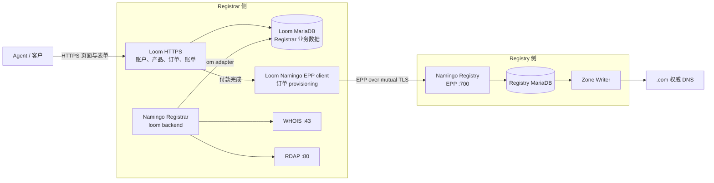
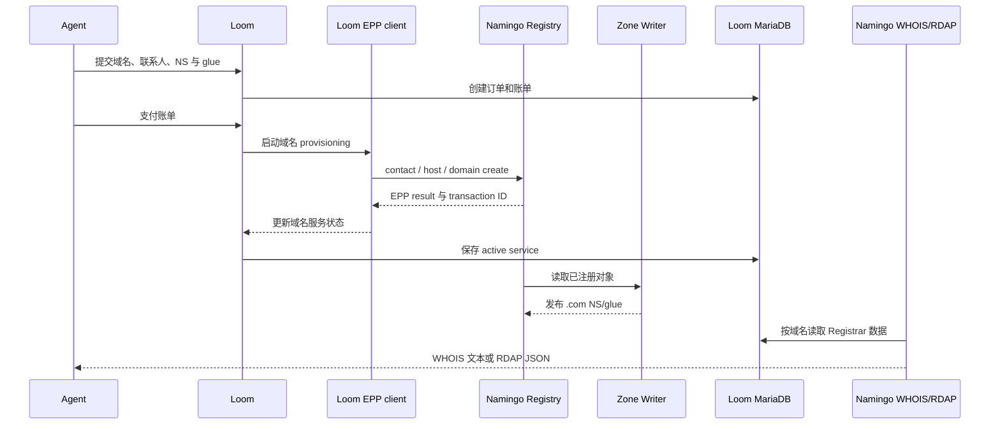

# Namingo Registrar 与 Loom 架构

## 整体结构

在 B02a 中，Loom 和 Namingo Registrar 共同组成 Registrar 侧，但承担不同工作：Loom 是客户与订单系统，Namingo Registrar 是注册数据查询服务。两者共享 Loom MariaDB 中的 Registrar 业务数据。



这张图中的关键关系是：

- Loom 保存客户、订单、账单和域名服务状态，并在付款后执行 EPP provisioning。
- Namingo Registrar 使用上游 `loom` backend 读取 Loom 数据，为同一批域名提供 WHOIS/RDAP。
- Namingo Registry 保存最终的 domain、contact 和 host 注册对象，并驱动 `.com` zone 发布。

## 数据流



Registry 和 Loom 各自保存不同视角的数据：Registry 是 TLD 的最终登记簿，Loom 保存 Registrar 的客户和订单视图。WHOIS/RDAP 使用 Loom 视图，DNS 委派则由 Registry 的 Zone Writer 发布。

## SeedEmu 部署

B02a 将 Loom 和 Namingo Registrar 部署为两个独立节点：

```text
10.150.0.74  Loom HTTPS frontend + Loom MariaDB + order EPP client
10.150.0.73  Namingo Registrar WHOIS/RDAP
10.154.0.73  Namingo Registry EPP + Registry MariaDB + Zone Writer
```

`NamingoRegistrarService` 使用如下组合：

```python
registrar.install("namingo-registrar").setBackend("loom").setExternalDatabase(
    host=LOOM_IP,
    port=3306,
    name="loom",
    username=LOOM_RDDS_DB_USER,
    password=LOOM_RDDS_DB_PASSWORD,
)
```

这里的外部数据库是 Loom 自己的 MariaDB，而不是 Registry 数据库。B02a 为 Namingo Registrar 创建只读查询账号，使 WHOIS/RDAP 可以读取 Loom 的 provider、service、contact 和 nameserver 数据。当前组合不启用 Namingo automation，域名生命周期任务由 Loom 负责。

固定版本的 Namingo Registrar adapter 与固定版本 Loom schema 在服务类型字段上存在命名差异。镜像构建时会检查并应用对应的兼容修正，使 WHOIS/RDAP 查询当前 Loom 的 `services.type` 字段。

## 与 Agent 工具的关系

Agent 不直接调用 Namingo Registrar 完成购买。购买入口是 Loom：

1. `domain.registrar_find` 发现 Loom HTTPS origin。
2. `domain.registrar_request` 从所选 source 访问 Loom 页面、维持 session，并提交注册及支付表单。
3. Loom 在内部完成订单处理和 EPP provisioning。
4. 购买后可以通过 Namingo WHOIS/RDAP确认 Registrar 数据已经出现。
5. `dns.check_delegation` 和 `dns.lookup` 验证 Registry 发布的委派与最终解析。

`domain.registrar_request` 面向正常 HTML/HTTP 前端，不为 Loom 固化一套私有购买 API。source-local session 让 Agent 可以连续读取页面、保存 CSRF 字段、处理重定向并完成多个表单步骤。

## 与 DNS 的关系

Namingo Registry 注册成功后，Zone Writer 将 `example.com` 的 NS 和 glue 写入 `.com` zone。隐藏 Primary 装载新 zone，并同步公共 Secondary。递归解析器随后才能沿父区委派访问 source 自有的 `example.com` 权威 DNS。

购买完成后，`www.example.com` 等普通记录由 `dns.configure` 更新，不需要重新购买域名。若变更对外委派的 nameserver 或 glue，则再次进入 Registrar/Registry 生命周期。

## 相关实现

- `seed-emulator/seedemu/services/LoomRegistrarService.py`
- `seed-emulator/seedemu/services/NamingoRegistrarService.py`
- `seed-emulator/seedemu/services/NamingoRegistryService.py`
- `seed-emulator/examples/internet/B02a_domain_registration/domain_registration.py`
- `seedemu-agent-tools/tool-service/seedemu_tool_service/tools/dns/`

完整的 Agent、Registrar、Registry 和 DNS 架构见 `domain_register_design_zh.md`。

## 上游项目

- [Loom](https://github.com/getnamingo/loom)
- [Namingo Registrar](https://github.com/getnamingo/registrar)
- [Namingo Registrar Loom integration](https://github.com/getnamingo/registrar/blob/main/docs/install-loom.md)
- [Namingo Registry](https://github.com/getnamingo/registry)
- [Namingo EPP Client](https://github.com/getnamingo/epp-client)
