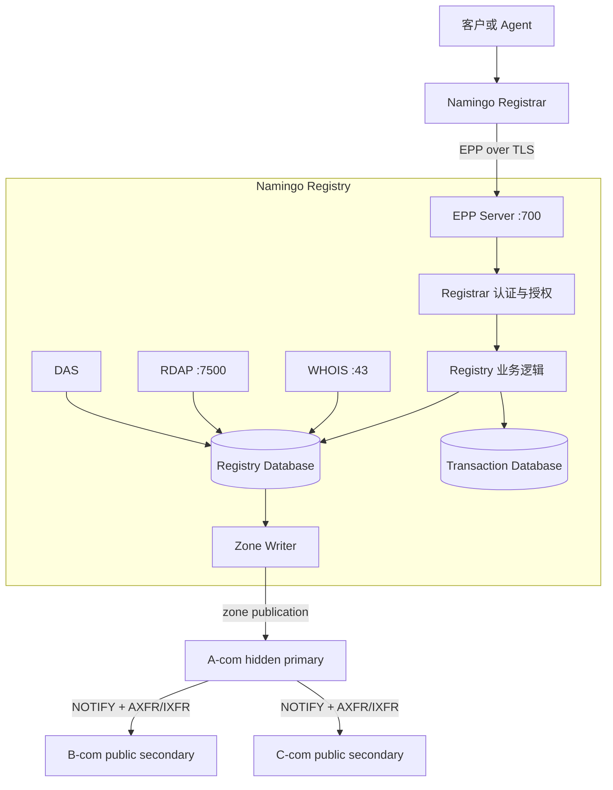

# Namingo Registry 框架与 SeedEmu 本地化说明

## 1. 文档目标

本文介绍 Namingo Registry 的组件框架、协议与数据边界，以及当前
`NamingoRegistryService` 在 SeedEmu 中承担的安装和编排职责。

Registry（注册局）位于 Registrar（注册商）与 TLD 权威 DNS 之间。它不直接面向普通用户
销售域名，而是接受已授权 Registrar 通过 EPP 提交的注册操作，维护某个 TLD 下唯一、最终的
登记数据，并把有效的域名委派交给 TLD 权威 DNS 发布。

一次完整的域名注册至少包含四个独立角色：

1. **Registrar**：接收客户或 Agent 的查询、购买和域名管理请求；
2. **Registry**：执行最终唯一性检查，维护 TLD 的权威登记数据；
3. **TLD 权威 DNS**：发布 Registry 批准的 NS 和 glue；
4. **用户权威 DNS**：托管 `example.com` 内的 `www`、MX、TXT 等记录。

## 2. 专业术语速查

| 术语                     | 中文及作用                                                                                     |
| ------------------------ | ---------------------------------------------------------------------------------------------- |
| **Registry**       | 注册局，维护一个或多个 TLD 下最终且唯一的域名登记数据                                          |
| **Registrar**      | 注册商，面向客户提供购买和管理服务，并通过 EPP 操作 Registry                                   |
| **TLD**            | Top-Level Domain，顶级域，例如`.com`、`.net`                                               |
| **EPP**            | Extensible Provisioning Protocol，Registrar 与 Registry 之间管理域名、联系人和 Host 的标准协议 |
| **RDDS**           | Registration Data Directory Services，注册数据查询服务的统称，主要包括 WHOIS 和 RDAP           |
| **WHOIS**          | 通常运行在 TCP 43 端口的传统文本注册数据查询协议                                               |
| **RDAP**           | 基于 HTTP 和 JSON 的现代注册数据查询协议                                                       |
| **DAS**            | Domain Availability Service，用于快速查询域名是否已经登记                                      |
| **ROID**           | Registry Object Identifier，Registry 为域名、联系人等对象分配的唯一标识                        |
| **Zone Writer**    | 将 Registry 数据库中的有效域名、NS 和 glue 转换为 TLD zone 的组件                              |
| **Hidden primary** | 保存和装载主 zone、但通常不直接服务公共查询的隐藏主权威服务器                                  |
| **NOTIFY**         | primary 通知 secondary 检查新 zone serial 的 DNS 消息                                          |
| **AXFR / IXFR**    | 完整区域传送和增量区域传送                                                                     |
| **TSIG**           | 使用共享密钥认证 DNS 消息的机制，用于区域传送或动态更新，不是 EPP 凭据                         |
| **Glue**           | 父区为域内 nameserver 附带的 A/AAAA 地址，用于打破解析循环                                     |

## 3. 总体框架



完整业务路径为：

```text
Agent
  -> Registrar
  -> EPP over TLS
  -> Registry
  -> Registry Database
  -> Zone Writer
  -> TLD hidden primary
  -> public authoritative secondaries
```

## 4. Registry 内部组件

### 4.1 EPP Server

EPP Server 是 Registry 的写入边界。Registrar 通常通过它执行：

- `domain:check`：检查域名是否可以注册；
- `contact:create`：创建注册联系人；
- `host:create`：创建 nameserver Host，必要时包含 glue；
- `domain:create`：创建域名登记对象；
- `domain:info`：读取最终登记状态；
- `domain:update`：修改 nameserver、状态或关联信息；
- `domain:renew`：续期域名；
- `domain:transfer`：在 Registrar 之间转移域名。

Registrar 本地显示“可购买”不能代替 Registry 的最终检查。多个 Registrar 同时申请同一个
域名时，Registry 必须通过数据库约束和事务保证只有一个请求成功。

### 4.2 Registrar 认证与授权

Registry 只允许已配置的 Registrar 登录 EPP。认证信息通常包括：

- EPP client ID（`clid`）和密码；
- Registrar 名称、IANA ID、对象前缀和联系邮箱；
- 允许连接的来源地址或 CIDR；
- 可选的 TLS 客户端证书和签发 CA；
- 账户余额、信用额度和操作权限。

生产式边界应使用 EPP over TLS。若启用双向 TLS，Registrar 验证 Registry 服务端证书，
Registry 同时验证 Registrar 客户端证书。DNS 区域传送使用的 TSIG 密钥不能代替这些凭据。

### 4.3 Registry 数据层

当前本地化实现使用 MariaDB，并创建两个逻辑数据库：

```text
registry
  保存 TLD、Registrar、域名、联系人、Host 和价格等核心登记数据

registryTransaction
  保存 Registry 操作的事务数据
```

Registrar 数据库与 Registry 数据库必须分开：Registrar 保存客户、订单、付款和本地业务
状态；Registry 保存最终登记事实。Registrar 应通过 EPP 操作 Registry，不能直接修改
Registry 数据库。

### 4.4 WHOIS、RDAP 和 DAS

WHOIS、RDAP 和 DAS 都属于查询面，不负责购买或创建域名：

- WHOIS 返回传统文本格式的注册数据；
- RDAP 通过 HTTP/JSON 返回结构化注册数据；
- DAS 快速回答域名是否已经登记。

小型实验如果只验证 EPP 注册闭环，可以关闭这些组件以降低进程数、内存和构建时间。

### 4.5 Zone Writer

Zone Writer 从 Registry 数据库读取有效域名登记，将 NS 和 glue 转换成 TLD zone 内容。例如：

```dns
example.com.       IN NS ns1.example.com.
example.com.       IN NS ns2.example.com.
ns1.example.com.   IN A  10.150.0.10
ns2.example.com.   IN A  10.151.0.10
```

Zone Writer 生成的是父区委派，不负责 `www.example.com`、MX、TXT 等用户区域内部记录。

## 5. Registry 与其他角色的边界

### 5.1 Registry 不等于 Registrar

Registrar 面向用户组织订单并发起 EPP 请求；Registry 决定域名是否最终登记。Registry
不需要提供购物、支付或客户门户。

### 5.2 Registry 不等于 TLD 权威 DNS

Registry 是登记控制面，TLD DNS 是发布和查询数据面。建议使用以下独立拓扑：

```text
Registry Zone Writer
  -> A-com hidden primary
  -> NOTIFY
  -> B-com / C-com public secondary
  -> AXFR/IXFR with TSIG
```

Registry 不应直接承担公共 DNS 查询，也不应假设 Registry 容器和 A-com 容器共享
`/etc/bind`。

### 5.3 Registry 不等于用户权威 DNS

Registry 只在 `.com` 父区发布 `example.com` 的 NS 和必要 glue。用户区域内部的记录仍由
独立的 managed DNS 或 `DomainNameService` 节点维护。

## 6. SeedEmu 本地化封装

当前工作区使用：

```text
seed-emulator/seedemu/services/NamingoRegistryService.py
```

封装分为两个层次。

### 6.1 NamingoRegistryServer

`NamingoRegistryServer` 表示安装到具体 SeedEmu 节点上的 Registry 实例，负责：

- 固定 Namingo Registry 的版本和 commit；
- 安装 PHP、Swoole、Composer、MariaDB 和可选 Nginx；
- 配置 EPP hostname、端口和 TLS；
- 初始化 TLD、Registrar 账户、价格和白名单；
- 根据需要启用 WHOIS、RDAP、DAS 和 Zone Writer；
- 写入 SQL、PHP 配置及容器启动脚本。

主要配置接口包括：

```python
server.setDatabase("registry", "registryuser", "password")
server.setEppEndpoint("epp.registry.seedemu", 700)
server.setTlds(["com", "net"])
server.setRoid("SEED")
server.setNameserverMode("hostObj")
server.setRegistrar(
    clid="seedemu",
    password="seedemu-epp",
    prefix="SEED",
    whitelist=["10.0.0.0/8"],
)
server.setTlsCertificate(certificate_pem, private_key_pem, client_ca_pem)
server.enableWhois()
server.enableRdap()
server.enableDas()
server.enableZoneWriter(zone_writer_config, interval_seconds=30)
```

EPP 始终启用，其他查询和发布组件按需启用，以便为小型仿真保留最小部署模式。

### 6.2 NamingoRegistryService

`NamingoRegistryService` 是 SeedEmu 服务层，负责创建 `NamingoRegistryServer`，并声明对
`Base` 层的依赖。场景代码可以这样使用：

```python
from seedemu import *

registry = NamingoRegistryService()
server = registry.install("registry")

server.setTlds(["com"])
server.setRegistrar(
    clid="seedemu",
    password="seedemu-epp",
    prefix="SEED",
    whitelist=["10.0.0.0/8"],
)

emu.addLayer(registry)
emu.addBinding(
    Binding(
        "registry",
        filter=Filter(asn=151, nodeName="registry"),
    )
)
```

`Service` 定义可复用的服务层，`Server` 保存单个安装实例的具体配置，`Binding` 则把虚拟
服务名映射到仿真拓扑中的实际节点。

## 7. 构建与启动过程

构建阶段大致执行：

```text
安装 MariaDB、Git 和 OpenSSL
  -> 安装 PHP、Swoole 和 Composer
  -> 克隆固定版本的 Namingo Registry
  -> 校验 commit
  -> 为启用的组件执行 composer install
  -> 写入配置、SQL、证书和启动脚本
```

容器启动阶段大致执行：

```text
启动 MariaDB
  -> 等待数据库 ready
  -> 创建数据库与用户
  -> 首次启动时导入上游 Schema
  -> 初始化 TLD 和 Registrar
  -> 生成或载入 EPP TLS 证书
  -> 启动 EPP
  -> 按配置启动 WHOIS、RDAP、DAS 和 Zone Writer
```

当前实现固定上游 release 和 commit，避免构建时意外跟随 `main`。不过构建仍然依赖 apt、
Git 和 Composer 公网资源；需要离线或高重复性的实验时，应进一步使用预构建基础镜像或本地
依赖镜像。

## 8. TLD zone 的跨容器发布

当前 `NamingoRegistryService` 只负责让 Zone Writer 在 Registry 节点内生成 zone。将 zone
安全交付给独立 A-com hidden primary 仍是一个明确的集成边界，建议流程为：

1. Registry 生成临时 zone；
2. 使用 `named-checkzone` 或等效工具验证；
3. 通过受认证的 API、SFTP 或其他网络通道发送到 A-com staging 路径；
4. A-com 再次验证；
5. 原子替换当前有效 zone；
6. reload 权威 DNS；
7. 向 B-com/C-com 发送 NOTIFY；
8. 验证 secondary serial、referral 和 glue 已经收敛。

共享 volume 可以简化实验，但会弱化 Registry 与权威 DNS 的网络和权限边界，不应被视为
唯一实现。

## 9. 当前实现状态

当前工作区已经新增 `NamingoRegistryService.py`，并通过
`seedemu/services/__init__.py` 导出了 `NamingoRegistryService` 和
`NamingoRegistryServer`。它已经覆盖：

```text
Registry 软件安装
+ MariaDB 初始化
+ EPP 配置与启动
+ TLD 和 Registrar 初始化
+ 可选 WHOIS/RDAP/DAS
+ 本地 Zone Writer
```

B02a 已完成以下运行验证：

- Loom/Namingo EPP client 到 Registry 的双向 TLS 登录和域名操作；
- Zone Writer 通过受限 SSH 将 `.com` 发布到 A-com 隐藏 Primary；
- B-com/C-com 使用 TSIG 完成 NOTIFY 与 AXFR/IXFR 收敛；
- Registry、Registrar、权威 DNS 的独立节点与 Binding；
- 从 Agent 购买 `example.com` 到公共 DNS referral/glue 和递归 A 记录的完整 Docker 流程。

Wrapper 仍负责可复现安装和编排，而不是向 Agent 暴露 Registry API。Registry 只接受获授权
Registrar 的 EPP 请求；Agent 和普通 source 不能直接访问 Registry 数据库或修改 TLD zone。

最终目标是：

```text
Registrar
  -> EPP/TLS
  -> Registry
  -> Zone Writer
  -> A-com hidden primary
  -> B-com/C-com public secondary
  -> DNS referral/glue 可查询
```

## 10. 建议测试层次

1. **渲染测试**：检查软件、配置文件、启动命令和 Binding；
2. **镜像测试**：验证固定版本源码、Composer 和 PHP 扩展能够安装；
3. **进程测试**：验证 MariaDB 和 EPP 在无 systemd 的容器中启动；
4. **协议测试**：覆盖 EPP login、check、create、info、update 和错误 result code；
5. **发布测试**：验证 zone 校验、A-com 装载和 secondary 传送；
6. **端到端测试**：注册 `example.com` 并查询到正确 NS/glue；
7. **失败测试**：覆盖重复注册、证书错误、zone 校验失败和 secondary 未收敛；
8. **重启测试**：验证 Registry 对象、事务和 zone serial 能够保持。

## 11. 上游参考

- Namingo Registry：[https://github.com/getnamingo/registry](https://github.com/getnamingo/registry)
- Namingo Registry DNS 文档：[https://github.com/getnamingo/registry/blob/main/docs/dns.md](https://github.com/getnamingo/registry/blob/main/docs/dns.md)
- Namingo Registrar：[https://github.com/getnamingo/registrar](https://github.com/getnamingo/registrar)
- Namingo EPP Client：[https://github.com/getnamingo/epp-client](https://github.com/getnamingo/epp-client)
