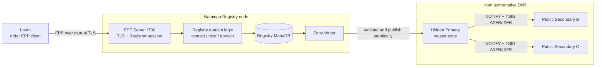
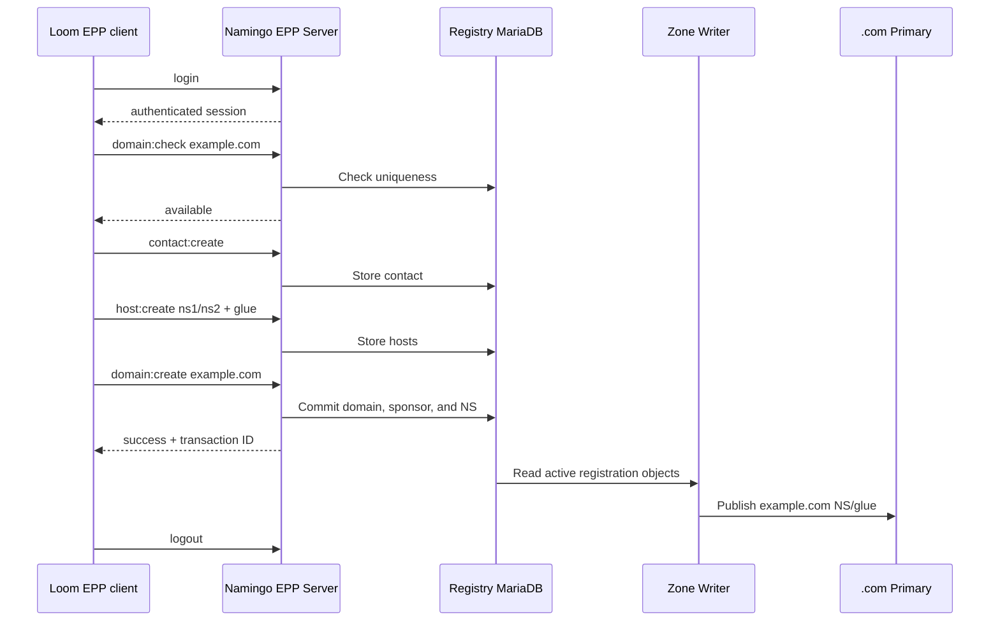
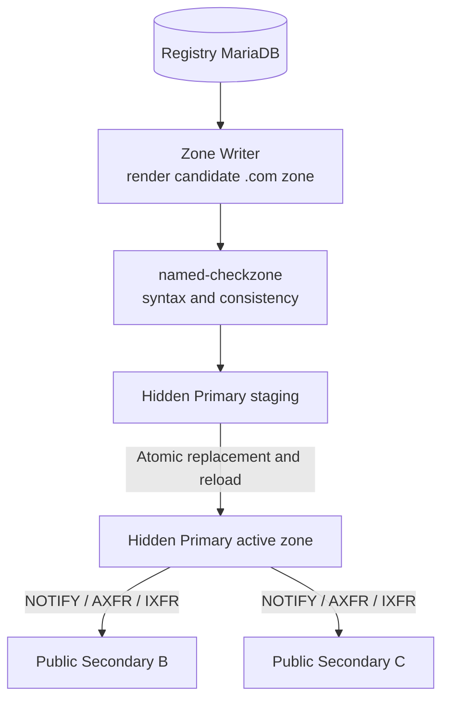

# Namingo Registry and TLD DNS architecture

## Overall structure

Namingo Registry is the center of `.com` registration data. It accepts Registrar operations over EPP, stores domain, contact, and host objects in Registry MariaDB, and uses Zone Writer to produce parent-zone delegations.



The Registry database and `.com` zone are two representations of the same registration state. The database supports transactions and object management; the zone publishes DNS delegations. Zone Writer converts active Registry objects into NS and glue records.

## EPP registration transaction



`domain:check` reports availability before registration, but `domain:create` still performs the final uniqueness check within the Registry transaction. In-zone nameservers such as `ns1.example.com` require glue, so the flow creates host objects with addresses before the domain references them.

## Zone Writer and `.com` DNS



B02a separates the hidden Primary from the public Secondaries. Zone Writer sends a candidate zone through an authenticated publication channel. The Primary validates and loads it, then synchronizes both public Secondaries using NOTIFY and TSIG-protected zone transfers.

A resolver obtains the `example.com` NS and glue from a public `.com` Secondary and then queries the source-owned authoritative DNS for the final record.

## Relationship to the Registrar side

Loom and Namingo Registry communicate over EPP but do not share databases. Loom stores accounts, orders, invoices, and Registrar service state. The Registry stores registration objects and sponsoring-Registrar state.

Namingo Registrar WHOIS/RDAP reads Loom MariaDB rather than Registry MariaDB. This exposes the Registrar view while EPP and Zone Writer remain based on the Registry's committed state.

## SeedEmu deployment

```text
10.150.0.74  Loom Registrar frontend and order EPP client
10.150.0.73  Namingo Registrar WHOIS/RDAP
10.154.0.73  Namingo Registry EPP, MariaDB, and Zone Writer
10.151.0.71  .com hidden Primary
10.152.0.71  .com public Secondary B
10.153.0.73  .com public Secondary C
```

`NamingoRegistryService` generates the database, EPP, TLS, Registrar-account, TLD, and Zone Writer configuration. `domain_registration.py` binds these services to the B02a nodes and configures the hidden-primary/public-secondary topology.

## Agent-visible workflow

The Agent does not operate the Registry directly:

1. `domain.registrar_request` submits the Loom order and payment, indirectly triggering EPP provisioning.
2. Loom and Namingo WHOIS/RDAP expose the active Registrar-side service.
3. `dns.check_delegation` compares the published parent NS/glue with the child authorities.
4. `dns.lookup` verifies the complete path through both recursive resolvers.

## Related implementation

- `seed-emulator/seedemu/services/NamingoRegistryService.py`
- `seed-emulator/seedemu/services/NamingoRegistrarService.py`
- `seed-emulator/seedemu/services/DomainNameService.py`
- `seed-emulator/examples/internet/B02a_domain_registration/domain_registration.py`
- `seedemu-agent-tools/tool-service/seedemu_tool_service/tools/dns/`

## Upstream projects

- [Namingo Registry](https://github.com/getnamingo/registry)
- [Namingo Registry DNS documentation](https://github.com/getnamingo/registry/blob/main/docs/dns.md)
- [Namingo EPP Client](https://github.com/getnamingo/epp-client)
