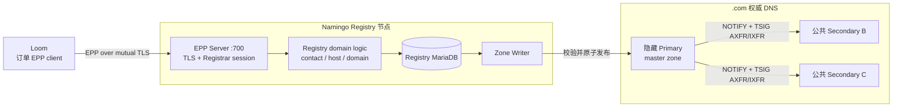
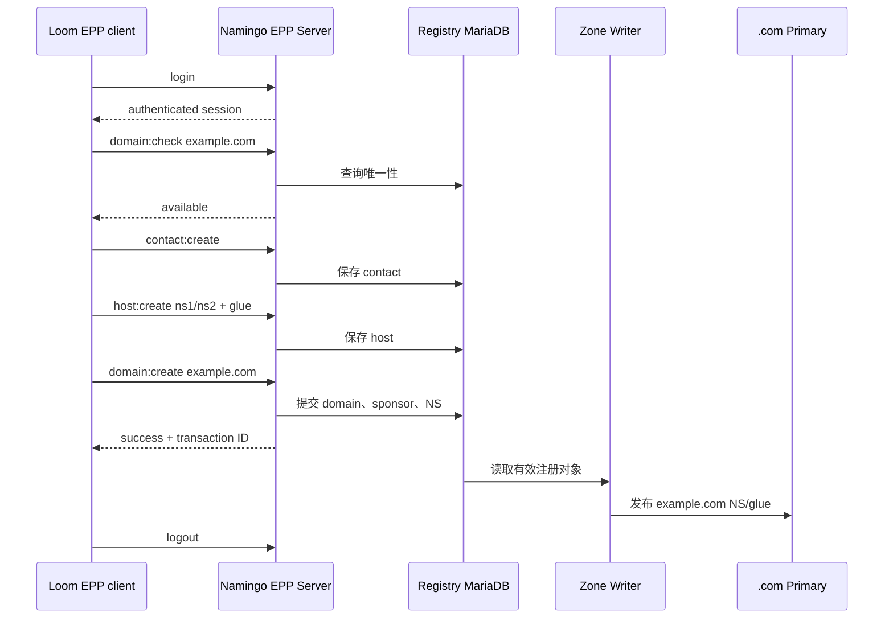
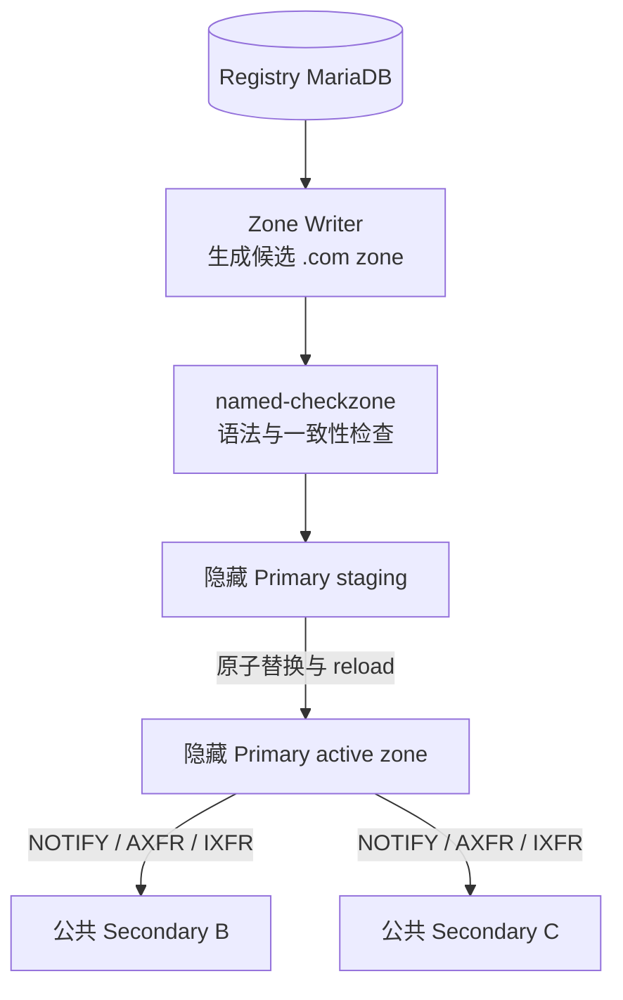

# Namingo Registry 与 TLD DNS 架构

## 整体结构

Namingo Registry 是 `.com` 注册数据的中心。它通过 EPP 接收 Registrar 的注册操作，将 domain、contact 和 host 对象保存在 Registry MariaDB，再由 Zone Writer 生成父区委派数据。



Registry 数据库和 `.com` zone 是同一注册事实的两个表示：数据库用于事务和对象管理，zone 用于公开 DNS 委派。Zone Writer 负责把已经生效的 Registry 对象转换成 NS 和 glue。

## EPP 注册事务

Loom 完成订单支付后，通过 Namingo EPP client 执行注册。典型对象顺序如下：



`domain:check` 提供注册前可用性信息，`domain:create` 时 Registry 仍会在事务中执行最终唯一性判断。注册成功后，Loom 保存 Registrar 侧服务状态；Registry 则保存 TLD 的最终登记状态。

域内 nameserver（例如 `ns1.example.com`）需要 glue，因此 EPP 流程先创建带地址的 host 对象，再让 domain 对象引用这些 host。

## Zone Writer 与 `.com` DNS



B02a 将 hidden Primary 和公共 Secondary 分开部署。Zone Writer 通过受认证的发布通道把候选 zone 交给 hidden Primary；Primary 校验并装载后，使用 NOTIFY 和 TSIG 保护的区域传送同步两台公共 Secondary。

公共解析路径只看到 Secondary。查询 `www.example.com` 时，递归解析器首先从 `.com` 获得 `example.com` 的 NS 和 glue，再访问 source 自有权威 DNS 获取最终 A 记录。

## 与 Registrar 侧的关系

Loom 和 Namingo Registry 通过 EPP 相连，但两者数据库不共享。Loom 保存账户、订单、账单和 Registrar 服务状态；Registry 保存注册对象和 sponsoring Registrar 信息。

Namingo Registrar 的 WHOIS/RDAP读取 Loom MariaDB，而不是 Registry MariaDB。这样查询服务呈现 Registrar 侧数据，同时 EPP 和 Zone Writer 仍以 Registry 登记结果为准。

## SeedEmu 部署

B02a 中的核心节点为：

```text
10.150.0.74  Loom Registrar frontend and order EPP client
10.150.0.73  Namingo Registrar WHOIS/RDAP
10.154.0.73  Namingo Registry EPP, MariaDB, and Zone Writer
10.151.0.71  .com hidden Primary
10.152.0.71  .com public Secondary B
10.153.0.73  .com public Secondary C
```

`NamingoRegistryService` 负责生成 Registry 节点所需的数据库、EPP、TLS、Registrar 账户、TLD 和 Zone Writer 配置。`domain_registration.py` 将服务绑定到上述节点，并配置 hidden-primary/public-secondary DNS 拓扑。

## Agent 观察到的流程

Agent 不直接操作 Registry。它通过 Loom 完成购买，再使用 DNS 工具观察 Registry 的结果：

1. `domain.registrar_request` 提交订单和付款，间接触发 Loom EPP provisioning。
2. Loom 页面和 Namingo WHOIS/RDAP显示 Registrar 侧服务已经生效。
3. `dns.check_delegation` 检查 Zone Writer 发布的父区 NS/glue 和子区权威数据。
4. `dns.lookup` 通过两台递归解析器检查完整 DNS 路径。

这使 Agent 面向正常 Registrar 和 DNS 接口工作，而 EPP、Registry 数据库与 zone 发布保持在仿真基础设施内部。

## 相关实现

- `seed-emulator/seedemu/services/NamingoRegistryService.py`
- `seed-emulator/seedemu/services/NamingoRegistrarService.py`
- `seed-emulator/seedemu/services/DomainNameService.py`
- `seed-emulator/examples/internet/B02a_domain_registration/domain_registration.py`
- `seedemu-agent-tools/tool-service/seedemu_tool_service/tools/dns/`

## 上游项目

- [Namingo Registry](https://github.com/getnamingo/registry)
- [Namingo Registry DNS documentation](https://github.com/getnamingo/registry/blob/main/docs/dns.md)
- [Namingo EPP Client](https://github.com/getnamingo/epp-client)
