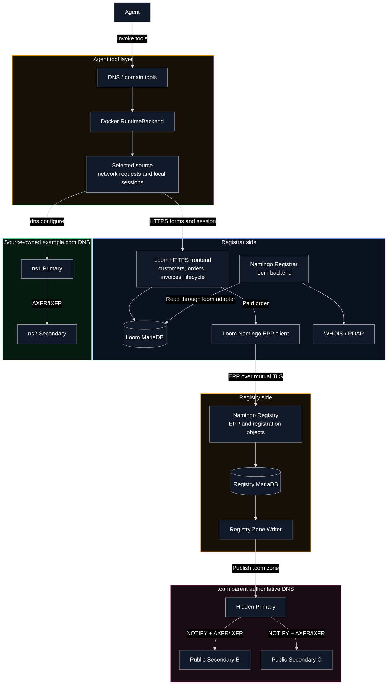
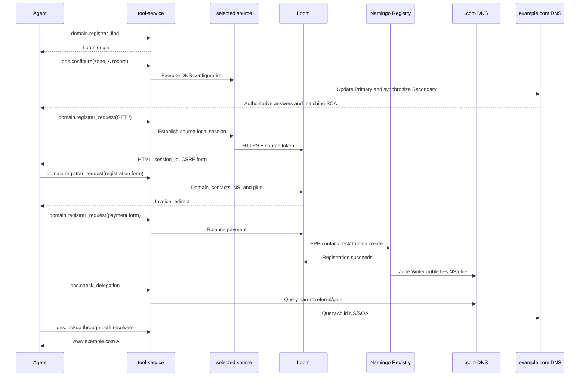

# Source-owned DNS and domain-registration design

## Architecture overview

B02a demonstrates how an Agent configures authoritative DNS inside a SeedEmu network and registers `example.com` through Loom and Namingo. The system consists of the Agent tool layer, the Registrar side, the Registry side, and the parent and child DNS services.

Loom is the business entry point for registration. It stores customers, orders, and invoices, then uses EPP to create contact, host, and domain objects in Namingo Registry after payment. Namingo Registrar reads the same Loom data through its `loom` backend and exposes it through WHOIS and RDAP. The Registry Zone Writer publishes successful delegations to the `.com` authoritative DNS system.

The parent and child zones hold different data: `.com` contains the NS delegation and glue for `example.com`, while the source-owned DNS contains records such as `www.example.com`. Standard DNS delegation connects the two layers.

## Agent tool workflow

The concrete call sequence is:

1. The Agent calls `domain.registrar_find` to discover the Loom origin published in service metadata.
2. It calls `dns.configure` to provision the `example.com` child zone and its records. The tool verifies both authorities and their SOA state.
3. It calls `domain.registrar_request` for the Loom home page. The selected source establishes an authenticated session, and the tool returns the page, `session_id`, and HTTP evidence.
4. Using the same `session_id`, the Agent reads the registration form, preserves its CSRF fields, and submits the domain, contacts, `ns1/ns2`, and glue addresses.
5. Loom creates an order and invoice. The Agent reads the payment page and submits a balance payment.
6. Loom's EPP client creates the registration objects in Namingo Registry. Zone Writer then publishes the `.com` delegation.
7. The Agent calls `dns.check_delegation` to compare parent NS/glue with both child authorities.
8. It calls `dns.lookup` through both B02a recursive resolvers to verify the final A record.

Registrar sessions and private credentials remain in the selected source. The Agent works with discoverable Loom pages and structured DNS results. Parent-zone changes go through the Registrar/Registry path, while ordinary child-zone records continue to use `dns.configure` after purchase.

## Namingo Registrar and Loom

B02a configures `NamingoRegistrarService` with the `loom` backend. Namingo Registrar connects to Loom MariaDB through a dedicated read-only account, so WHOIS/RDAP and the Loom order view use the same Registrar data. Namingo automation is disabled in B02a because Loom owns the order-driven lifecycle.

## DNS publication and resolution

Namingo Registry passes registration data to Zone Writer. Zone Writer publishes it to the `.com` hidden Primary, which synchronizes the two public Secondaries using NOTIFY and TSIG-protected AXFR/IXFR. Recursive resolvers obtain the `example.com` referral and glue from a public Secondary and then query the source-owned authoritative DNS.

Dynamic delegation may interact with recursive caches. The complete test therefore waits for both B02a recursive resolvers instead of validating only one, and it does not flush caches to manufacture a successful result.

## Implementation and validation

The principal implementation locations are:

- `seed-emulator/examples/internet/B02a_domain_registration/domain_registration.py`
- `seed-emulator/seedemu/services/LoomRegistrarService.py`
- `seed-emulator/seedemu/services/NamingoRegistrarService.py`
- `seed-emulator/seedemu/services/NamingoRegistryService.py`
- `seedemu-agent-tools/tool-service/seedemu_tool_service/tools/dns/`

The Docker purchase test covers the Loom session, order and payment, EPP registration, WHOIS/RDAP, parent delegation, child authoritative responses, and final resolution through both recursive resolvers.
