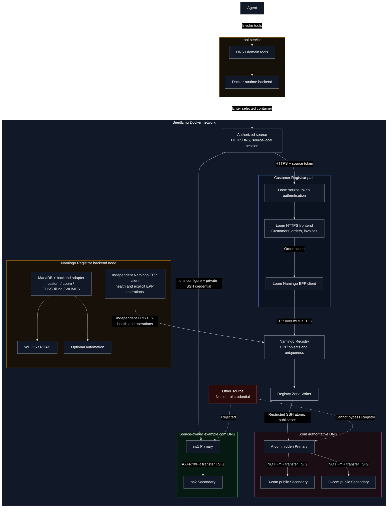

# Source-owned DNS and domain-registration design

## Scope

This document describes the implemented B02a path in which an Agent uses a selected emulated source to configure authoritative DNS and purchase `example.com` through a normal Registrar frontend. It does not define a private Registrar REST API.

## Components and trust boundaries

- The tool-service validates arguments and executes network operations inside the selected source through `RuntimeBackend`.
- Loom owns customer sessions, orders, invoices, and the customer-facing HTML workflow.
- Namingo Registry is authoritative for domain uniqueness, sponsorship, nameservers, and glue. Loom communicates with it through mutually authenticated EPP over TLS.
- Registry Zone Writer publishes `.com` to a query-hidden Primary. NOTIFY and TSIG-protected AXFR/IXFR distribute the zone to public Secondaries.
- The source-owned DNS pair serves the child zone. Runtime update and Primary/Secondary transfer credentials are separate.

No source, Agent, or Registrar may update the TLD zone directly. No Registry database is shared with Loom or the source-owned DNS servers.

## Namingo Registrar backend

The Namingo Registrar backend and Loom are separate deployment roles and must not be collapsed into one component:

- Loom is the customer portal used by the current purchase workflow. Its Namingo EPP client submits order-driven EPP operations directly to the Registry.
- `NamingoRegistrarService` deploys a separate MariaDB and supports `custom`, `loom`, `foss`, and `whmcs` backend adapters. The adapter determines which customer or billing schema supplies WHOIS/RDAP data.
- The backend can run WHOIS, Nginx-fronted RDAP, and an optional automation worker. Without a compatible schema/adapter, the `custom` backend is only a template and must not be presented as a real registration-data source.
- `enableEppClient` installs the pinned official Namingo EPP client, protects its CA/client certificate/private key/configuration, and periodically writes `/run/seedemu-epp-health.json`. B02a uses it to verify EPP/TLS capability from the Registrar backend node and for explicit EPP tests; Loom purchases do not pass through this WHOIS/RDAP backend.
- Both the Loom node and the Namingo Registrar backend node are authorized Registrar-side clients at the Registry boundary, but they have separate processes and addresses and neither may access the Registry database.

## Discovery and source authentication

Loom publishes `agent.exposed.registrar_url`; Docker compilation maps it into SeedEmu metadata labels. `domain.registrar_find` trusts only this explicit exposure contract and returns the normalized origin plus an optional opaque `credential_ref`.

`domain.registrar_request` accepts only GET/POST and same-origin paths, does not automatically follow redirects, bounds request and response sizes, and returns HTTP status, content type, location, body, and session evidence. The Agent begins with `GET /` and discovers Loom's forms and same-origin scripts.

For `authentication=auto` or `required`, the selected source uses its provisioned source ID, token, and CA certificate to establish a Loom session over HTTPS. Cookies are stored under `/var/lib/seedemu/registrar/<origin-hash>/` inside that source. Authentication by source name alone is forbidden; tool ingress must authorize source selection.

## Authoritative DNS configuration

`dns.configure` operates only on a configured `dns_service_id`, zone allowlist, and authorized source. B02a provisions credentials only to `as150h-host_1-10.150.0.72` for `b02a.source-owned-dns` and `example.com`.

The operation provisions the child Primary and Secondary when needed, applies RRset replacements/deletions, and verifies authoritative answers and matching SOA state. This occurs before parent delegation, so direct authoritative queries are used for verification.

## Purchase and delegation workflow

1. Discover Loom with `domain.registrar_find`.
2. Configure `example.com` and its records with `dns.configure`.
3. Request Loom pages with `domain.registrar_request`, preserving `session_id` and CSRF fields.
4. Submit the order with `ns1.example.com`, `ns2.example.com`, and IPv4 glue, then pay the invoice.
5. Loom creates Registry objects through EPP. The Registry rejects duplicates and remains authoritative for availability.
6. Zone Writer publishes NS/glue to `.com`; its public Secondaries converge.
7. Verify parent referral/glue, both child authorities, and recursive resolution.

After purchase, ordinary records inside `example.com` are changed with `dns.configure`. Nameserver/glue changes, renewal, transfer, and registration status remain Registrar/Registry operations.

## Implemented validation

Fake-backend tests cover parsing, validation, discovery restrictions, source-local sessions, and tool registration. Docker tests cover source authentication, Loom HTML/session access, source-owned DNS convergence, purchase/payment, EPP registration, parent delegation/glue, and final recursive resolution. The purchase test requires a fresh Registry because it registers `example.com`.
