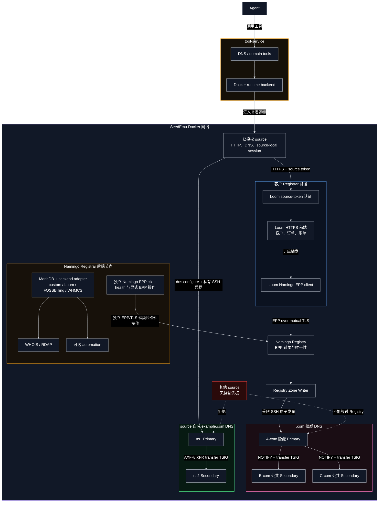

# source 自有 DNS 与域名注册设计

## 范围

本文描述 B02a 当前已实现的流程：Agent 通过所选仿真 source 配置自有权威 DNS，并通过正常 Registrar 前端购买 `example.com`。设计不为 Registrar 假设或固化私有 REST API。

## 组件与信任边界

- tool-service 校验参数，并通过 `RuntimeBackend` 在所选 source 内执行网络操作。
- Loom 负责客户会话、订单、账单和面向客户的 HTML 流程。
- Namingo Registry 最终决定域名唯一性、sponsoring Registrar、nameserver 和 glue；Loom 通过双向认证的 EPP over TLS 与其通信。
- Registry Zone Writer 把 `.com` 发布到不对外查询的隐藏 Primary，再通过 NOTIFY 和 TSIG 保护的 AXFR/IXFR 同步到公共 Secondary。
- source 自有 DNS 对外提供子区权威服务；运行时更新和主从传送凭据相互分离。

source、Agent 和 Registrar 都不能绕过 Registry 修改 TLD zone。Registry 数据库不与 Loom 或自有 DNS 共用。

## Namingo Registrar 后端

Namingo Registrar 后端和 Loom 是两个独立部署角色，不能把二者合并成一个方框：

- Loom 是当前购买流程的客户门户，自带 Namingo EPP client，直接向 Registry 提交订单产生的 EPP 操作。
- `NamingoRegistrarService` 部署独立 MariaDB，并支持 `custom`、`loom`、`foss` 和 `whmcs` backend adapter；adapter 决定 WHOIS/RDAP 从哪种客户或计费数据模型读取信息。
- Namingo 后端可启动 WHOIS、Nginx 代理的 RDAP 和可选 automation worker；`custom` backend 没有兼容 schema/adapter 时只能作为模板，不能宣称返回真实注册数据。
- `enableEppClient` 安装固定版本的官方 Namingo EPP client，写入受保护的 CA、客户端证书、私钥和配置，并周期性生成 `/run/seedemu-epp-health.json`。B02a 使用它验证 Registrar 节点到 Registry 的 EPP/TLS 能力和执行显式 EPP 测试；Loom 购买请求不经过该 WHOIS/RDAP backend。
- Loom 节点和 Namingo Registrar 后端节点都作为获授权 Registrar 客户端出现在 Registry 边界内，但各自拥有独立进程和地址；它们都不能访问 Registry 数据库。

## 服务发现与 source 认证

Loom 发布 `agent.exposed.registrar_url`，Docker 编译器将其转换为 SeedEmu metadata label。`domain.registrar_find` 只信任这一显式暴露契约，返回规范化 origin 和可选的不透明 `credential_ref`。

`domain.registrar_request` 只允许 GET/POST 和同源路径，不自动跟随重定向，并限制请求与响应大小。它返回 HTTP 状态、content type、location、正文和 session 证据。Agent 从 `GET /` 开始，根据 Loom 的表单和同源脚本理解业务流程。

当 `authentication=auto` 或 `required` 时，所选 source 使用已配置的 source ID、token 和 CA，通过 HTTPS 建立 Loom 会话。cookie 保存在 source 内的 `/var/lib/seedemu/registrar/<origin-hash>/`。source 名称本身不能作为认证；工具入口还必须授权调用者选择该 source。

## 自有权威 DNS 配置

`dns.configure` 只允许配置好的 `dns_service_id`、zone allowlist 和获授权 source。B02a 只为 `as150h-host_1-10.150.0.72` 配置管理 `b02a.source-owned-dns` 与 `example.com` 的凭据。

工具按需创建子区 Primary/Secondary，执行 RRset 替换或删除，并验证权威响应和 SOA 一致性。该步骤发生在父区委派之前，因此使用直接权威查询验证。

## 购买与委派流程

1. 使用 `domain.registrar_find` 发现 Loom。
2. 使用 `dns.configure` 配置 `example.com` 及其记录。
3. 使用 `domain.registrar_request` 读取 Loom 页面，并保留 `session_id` 与 CSRF 字段。
4. 提交包含 `ns1.example.com`、`ns2.example.com` 及 IPv4 glue 的订单，然后支付账单。
5. Loom 通过 EPP 创建 Registry 对象；Registry 拒绝重复域名，并最终决定可用性。
6. Zone Writer 将 NS/glue 发布到 `.com`，公共 Secondary 完成收敛。
7. 验证父区 referral/glue、两台子区权威服务器和最终递归解析。

购买完成后，`example.com` 内的普通记录直接通过 `dns.configure` 更新。nameserver/glue 变更、续费、转移和注册状态仍属于 Registrar/Registry 操作。

## 已实现验证

Fake backend 测试覆盖解析、参数校验、发现限制、source-local session 和工具注册。Docker 测试覆盖 source 认证、Loom HTML/session、自有 DNS 主从收敛、购买与付款、EPP 注册、父区委派/glue 和最终递归解析。购买测试会注册 `example.com`，因此要求全新的 Registry。
